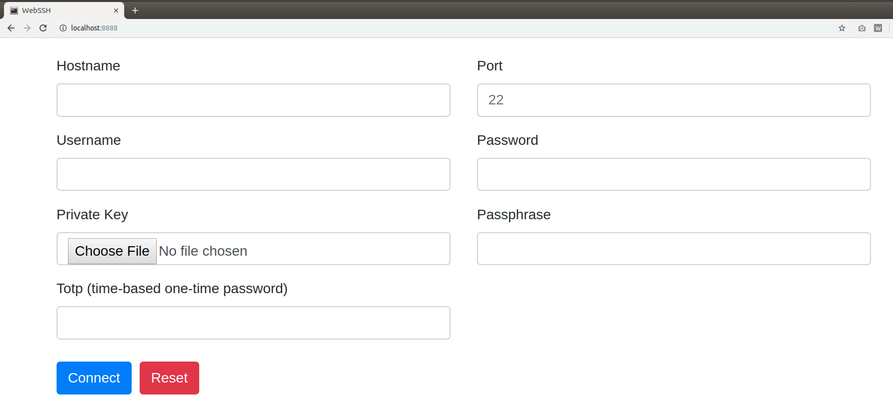
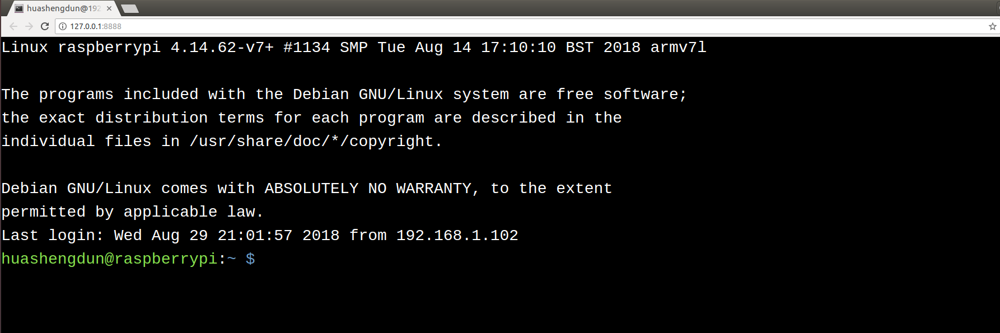

## WebSSHCN

### By hahaTT0902, Forked from Shengdun Hua

[](https://github.com/huashengdun/webssh/actions/workflows/python.yml)
[](https://raw.githubusercontent.com/huashengdun/webssh/coverage-badge/coverage.svg)


### 介绍

一个简单的 Web 应用程序，可用作 SSH 客户端连接到您的 SSH 服务器。汉化后更加简便

### 特性

* 支持 SSH 密码身份验证，包括空密码。
* 支持 SSH 公钥身份验证，包括 DSA RSA ECDSA Ed25519 密钥。
* 支持加密密钥。
* 支持双因素身份验证（基于时间的一次性密码）。
* 支持全屏终端。
* 终端窗口可调整大小。
* 自动检测 SSH 服务器的默认编码。
* 支持现代浏览器，包括 Chrome、Firefox、Safari、Edge、Opera。

### 预览




### 工作原理

```
+---------+     http     +--------+    ssh    +-----------+
| 浏览器  | <==========> | webssh | <=======> | ssh 服务器 |
+---------+   websocket  +--------+    ssh    +-----------+
```

### 要求

* Python 3.8+

### 快速入门

1. 安装此应用，运行命令 `pip install webssh`
2. 启动 Web 服务器，运行命令 `wssh`
3. 打开浏览器，导航到 `127.0.0.1:8888`
4. 输入您的数据，提交表单。

### 服务器选项

```bash
# 使用指定的监听地址和端口启动 HTTP 服务器
wssh --address='2.2.2.2' --port=8000

# 启动 HTTPS 服务器，必须传递 certfile 和 keyfile
wssh --certfile='/path/to/cert.crt' --keyfile='/path/to/cert.key'

# 缺少主机密钥策略
wssh --policy=reject

# 日志级别
wssh --logging=debug

# 记录到文件
wssh --log-file-prefix=main.log

# 更多选项
wssh --help
```

### 浏览器控制台

```javascript
// 连接到您的 SSH 服务器
wssh.connect(hostname, port, username, password, privatekey, passphrase, totp);

// 向 wssh.connect 传递一个对象
var opts = {
  hostname: 'hostname',
  port: 'port',
  username: 'username',
  password: 'password',
  privatekey: 'the private key text',
  passphrase: 'passphrase',
  totp: 'totp'
};
wssh.connect(opts);

// 如果不带参数，wssh 将使用表单数据进行连接
wssh.connect();

// 设置客户端使用的新编码
wssh.set_encoding(encoding);

// 将编码重置为使用默认编码
wssh.reset_encoding();

// 向服务器发送命令
wssh.send('ls -l');
```

### 自定义字体

要使用自定义字体，请将字体文件放入目录 `webssh/static/css/fonts/` 并重新启动服务器。

### URL 参数

支持通过 URL（查询或片段）传递参数，如下例所示：

传递表单数据（密码必须以 base64 编码，不支持私钥）
```bash
http://localhost:8888/?hostname=xx&username=yy&password=str_base64_encoded
```

传递终端背景颜色
```bash
http://localhost:8888/#bgcolor=green
```

传递终端字体颜色
```bash
http://localhost:8888/#fontcolor=red
```

传递用户定义的标题
```bash
http://localhost:8888/?title=my-ssh-server
```

传递编码
```bash
http://localhost:8888/#encoding=gbk
```

传递字体大小
```bash
http://localhost:8888/#fontsize=24
```

传递登录后执行的命令
```bash
http://localhost:8888/?command=pwd
```

传递终端类型
```bash
http://localhost:8888/?term=xterm-256color
```

### 使用 Docker

启动应用
```
docker-compose up
```

关闭应用
```
docker-compose down
```

### 测试

要求
```
pip install pytest pytest-cov codecov flake8 mock
```

使用 unittest 运行所有测试
```
python -m unittest discover tests
```

使用 pytest 运行所有测试
```
python -m pytest tests
```

### 部署

在 Nginx 服务器后运行

```bash
wssh --address='127.0.0.1' --port=8888 --policy=reject
```
```nginx
# Nginx 配置示例
location / {
    proxy_pass http://127.0.0.1:8888;
    proxy_http_version 1.1;
    proxy_read_timeout 300;
    proxy_set_header Upgrade $http_upgrade;
    proxy_set_header Connection "upgrade";
    proxy_set_header Host $http_host;
    proxy_set_header X-Real-IP $remote_addr;
    proxy_set_header X-Real-PORT $remote_port;
}
```

作为独立服务器运行
```bash
wssh --port=8080 --sslport=4433 --certfile='cert.crt' --keyfile='cert.key' --xheaders=False --policy=reject
```


### 提示

* 无论您选择哪种部署方式，请不要忘记启用 SSL。
* 默认情况下，来自公共网络的纯 http 请求将被重定向或阻止，并且重定向优先于阻止。
* 尽量使用 reject 策略作为缺少主机密钥策略以及